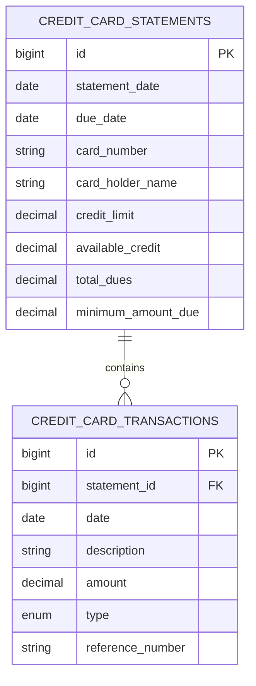

# Database Schema

*Related Documentation:*
- [🏗 Core Module](../modules/finance-core.md) - JPA entities and repositories
- [📐 Architecture Overview](../ARCHITECTURE.md) - System context
- [🌐 API Documentation](api-documentation.md) - REST endpoints using this data
- [📝 Parser Module](../modules/finance-parser.md) - Data source processing

## Current Schema (October 2025)

This document describes the database schema used by the Finance Tracker application. The schema is implemented using JPA entities in the [Core Module](../modules/finance-core.md).

### Credit Card Statements
```sql
CREATE TABLE credit_card_statements (
    id BIGINT PRIMARY KEY AUTO_INCREMENT,
    statement_date DATE NOT NULL,
    due_date DATE NOT NULL,
    card_number VARCHAR(20) NOT NULL,
    card_holder_name VARCHAR(100),
    credit_limit DECIMAL(10,2),
    available_credit DECIMAL(10,2),
    total_dues DECIMAL(10,2),
    minimum_amount_due DECIMAL(10,2),
    created_at TIMESTAMP DEFAULT CURRENT_TIMESTAMP,
    updated_at TIMESTAMP DEFAULT CURRENT_TIMESTAMP ON UPDATE CURRENT_TIMESTAMP
);

CREATE INDEX idx_card_number ON credit_card_statements(card_number);
CREATE INDEX idx_statement_date ON credit_card_statements(statement_date);
```

### Credit Card Transactions
```sql
CREATE TABLE credit_card_transactions (
    id BIGINT PRIMARY KEY AUTO_INCREMENT,
    statement_id BIGINT NOT NULL,
    date DATE NOT NULL,
    description VARCHAR(255) NOT NULL,
    amount DECIMAL(10,2) NOT NULL,
    type ENUM('CREDIT', 'DEBIT') NOT NULL,
    reference_number VARCHAR(50),
    created_at TIMESTAMP DEFAULT CURRENT_TIMESTAMP,
    FOREIGN KEY (statement_id) REFERENCES credit_card_statements(id)
);

CREATE INDEX idx_transaction_date ON credit_card_transactions(date);
CREATE INDEX idx_statement_id ON credit_card_transactions(statement_id);
```

## Relationships



## Future Schema Extensions

### Planned Tables
1. Accounts
   - For different bank accounts/cards
   - Account type classification
   - Bank details

2. Categories
   - Transaction categorization
   - Category hierarchies
   - Budget tracking

3. Rules
   - Auto-categorization rules
   - Merchant mapping
   - Pattern matching

4. Audit Logs
   - Import history
   - Data modifications
   - User actions